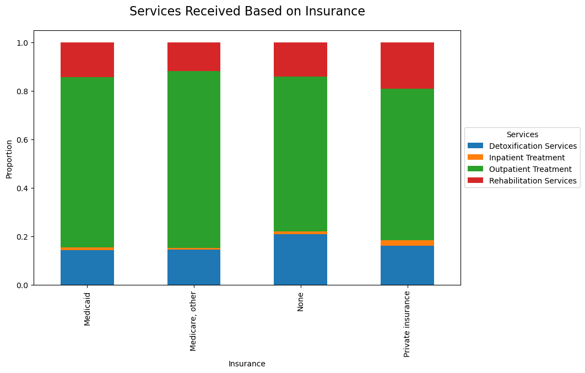

# Project - 1 Analysis of Substance Abuse Treatment Deserts in the United States
## 
This study examines substance abuse treatment center admissions in 2019, exploring the geographical disparities and trendlines to identify regional patterns, underlying factors, and implications for policy-making and resource allocation.
## Data Source
 This study utilizes data accessible from [Substance Abuse and Mental Health Services (SAMHSA.gov)](https://www.samhsa.gov) to examine substance abuse treatment center admissions and their geographical distribution in 2019. The data available publicly was from 2020 and earlier.  We chose to look at the 2019 since it was not influenced by Covid restrictions.   

 1.  Information on demographic, clinical and substance use characteristics of persons admitted to treatment: [TEDS DATA Files](https://www.samhsa.gov/data/data-we-collect/teds/datafiles)

 1. facility data on substance use treatment services: [N-SSATS DATA Files](https://www.samhsa.gov/data/data-we-collect/n-ssats/datafiles?puf_id=47343)

 Note: Data files was not pulled into GitHub due to the size of the file.
## Healthcare deserts five dimension of access 
- Availability
- Accessibility
- Accommodation
- Affordability 
- Acceptability

 ## Observations

1. We found that seven US states have a lower than average access to treatment.
    1.  We analyzed the total cases by the treatment centers capacity creating a ratio of beds available in each state.  The states that fell one standard deviation below the mean were Arizona, Colorado, Delaware, Maryland, New Jersey and Vermont.  

    1. Map of the total bed capacity ratio by state. Red indicated the state was one standard deviation below the mean. 

    1. We also plotted this data to understand if the capacity ration was affected by states with low bead or cases, 4 states indicated a large number of cases with a lower availability. 

1. We also studied the wait time by state to understand if any had wait times greater than 30 days.  We found that several states on our target list of potential deserts wait times over 30 days.  However, several did not and Arizona didn't report wait times.   

1. To understand accessibility deeper we reviewed the distribution of services provided by state.
Outpatient treatment made up the highest percentage over overall treatment by all states followed by rehabilitation services. 
    1. All States

    1.  We looked at the distribution of services for the target desert states and Arizona stood out since 97% of all treatment was outpatient treatment.   leading us to believe the reason they don't report wait times is the frequency of outpatient treatment and little to no wait for that treatment. 

1. One of the items we reviewed was treatment by age group to understand if there was arability of services by age group. While lower younger and older age people had less treatment this only led us to believe a deeper study of those groups would be necessary to gauge of they had a lack of facilities or if that group simply have less drug users leading to lower treatment numbers. 

1. Affordability plays a key role in identifying a healthcare desert to understand affordability we reviewed the payment method of services received and ownership distribution.
    1. Payment method
        1. The teds data frame was filtered to remove cases that did not provide the payment method of treatment. 
        1. An ANOVA test was run to identify if there was any significant difference with a results F-statistic: 0.4675476751194555, P-value: 0.519637175760407
            1.  Due to the low F-statistic there is no significant difference in the types of services received. 

1. When reviewing the ownership distribution across all states and the Privately Owner categories of for profit and non-profit stood out.   A deeper studied of the cost between these categories would be needed to fully understand the impact.  However, the lack of federally funded faculties was noted. 

## Conclusion
.1  There are seven state in the US that stand out as potential deserts with Arizona and Colorado standing out due to the low arability of services other then outpatient in Arizona and long wait times in Colorado.   We recommend a deeper study in these states to identify the demographics of those getting treatment along with the cost across ownership of the facilities.  We would also recommend an effort to gain additional federal funding to increase the overall capacity of available beds in all 7 states identified as potential deserts. 

